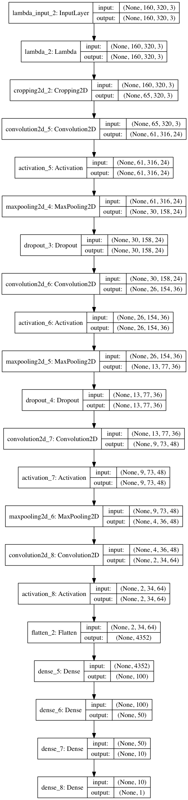
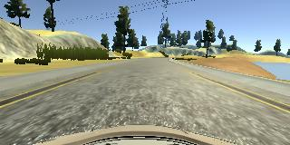
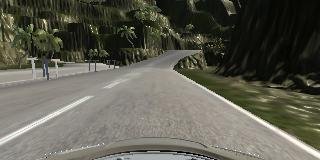
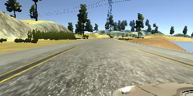
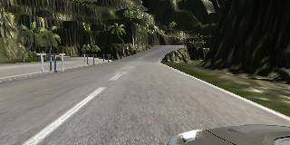
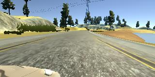
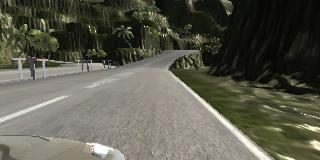
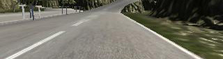

# **Behavioral Cloning** 


**Behavioral Cloning Project**

The goals / steps of this project are the following:
* Use the simulator to collect data of good driving behavior
* Build a convolution neural network in Keras that predicts steering angles from images
* Train and validate the model with a training and validation set
* Test that the model successfully drives around track one without leaving the road
* Summarize the results with a written report

Simulator can be downloaded <a href="https://d17h27t6h515a5.cloudfront.net/topher/2017/February/58ae4594_mac-sim.app/mac-sim.app.zip">here</a>

[//]: # (Image References)

[image1]: ./image/center_track1.jpg "center_track1 "
[image2]: ./image/left_track1.jpg "left_track1"
[image3]: ./image/right_track1.jpg "right_track1"
[image4]: ./image/center_track2.jpg "center_track2"
[image5]: ./image/left_track2.jpg "left_track2"
[image6]: ./image/right_track2.jpg "right_track2"
[image7]: ./image/center_track2_crop.jpg "cropped center_track2"

---

My project includes the following files:
* model.py containing the script to create and train the model
* drive.py for driving the car in autonomous mode
* model_track1.h5 containing a trained convolution neural network for track1
* model_track2.h5 containing a trained convolution neural network for track1
* writeup_report.md or writeup_report.pdf summarizing the results
Note that I have spent a day to tried to train a model works for both tracks, using all training data on 2 tracks and over 2 times paratemeters more than any single model, but the result is not good enough, so I can only submit 2 seperate models. Please leave a message if you have advise for me to get a powerful model for both tracks, I guess a lot more training data may be required.

#### 2. Submission includes functional code
Using the Udacity provided simulator and my drive.py file, the car can be driven autonomously around the track by executing 
```sh
python drive.py model.h5
```

#### 3. Submission code is usable and readable

understanding of generator:
generator is a mechanism in python, which is usually in form of a function Instead return something at the end of a function and free all temporary variable with that function scope, the generator use keyword 'yield' to return something at somewhere in the function, while save all the variables in the function, and next time when a 'next()' call on generator, the code inside would start excution after 'yield'. 
In this way, we can only load a small batch of data once without worrying about running out of memory for a large amount of data.

The model.py file contains the code for training and saving the convolution neural network. The file shows the pipeline I used for training and validating the model, and it contains comments to explain how the code works.

### 4.Model Architecture and Training Strategy

#### 1. An appropriate model architecture has been employed
Model: In this project, a convolutional neural network with 4 convolutional layers followed by 3 fully connected layers is used in training. 

#### 2. Attempts to reduce overfitting in the model
In order to defense againist overfitting in keras, l2 norm regularization and dropout are used here. 
A dropout layer followes each of the first 2 convolutional layers, this is a simple way to reduce overfitting.
Also, a l2 norm regularization is added to the first 2 convolational layers and the first fully connected layer. Training on the first track do not require this regularization, I obtain a fine model for it without using this. However, the performance of model on second track is much better after adding this regularization.


#### 3. Model parameter tuning
The model used an adam optimizer, so the learning rate was not tuned manually (model.py line 25).
Batch size is typcially in [10,200], here 96 is used as batch size in training. 
The number of epoches is set to 5-7, since based on the early stopping, 5 epoches is enough, more epoches does not help much in reducing loss. 
The 30% training dataset is used for validation, rest data is used in training. 
Also, since the input of the model is a single image which should be from the camera on the front of car, and output is a steering angle, a correction factor on the ground truth steering angle is involved when using image taken by two side cameras. The factor is set to 0.2 as suggested in lecture.
The number and dimension of layers is refered to the model which is used in real practice. 

#### 4. Appropriate training data
The raw data of dimention [160.320] firsly go through normalization and centering, then 50 rows on the top of image and 25 rows at the bottom are discarded, since that part of image contains mostly background, which is likely not to be helpful but probably bring about noises. 
In order to get more comprehensive data, both clockwise and counter-clockwise driving data is used in training. All three cameras' images are used, too. 


### 5. Final Model Architecture

The final model architecture (model.py lines 12-40) consisted of a convolution neural network with the following layers and layer sizes.
The 1st conv layer consists of 24 filters of size 5 by 5.
The 2nd conv layer consists of 36 filters of size 5 by 5.
The 3rd conv layer consists of 48 filters of size 5 by 5.
The 4th conv layer consists of 64 filters of size 3 by 3.
The first 2 conv layers are followed by an activation layer, a dropout layer and a pooling layer. The 3rd conv layer does not have dropout layer followed, there is only an activation layer after the 4th conv layer.
After that, 3 fully connected layers with size of 100, 50, and 25 is added before the final output layer. 

The image below is visualization of the model
<p align="center">
  
</p>
#### 3. Creation of the Training Set & Training Process

To capture good driving behavior, I recorded 3-5 laps on 2 tracks clockwise and counter clockwise respectively, using the center camera and both side cameras. Here are example images of three camera images:

<p align="center">
    &nbsp;&nbsp;&nbsp;&nbsp;&nbsp;&nbsp;  <br />
Center Image for 1st track   &nbsp;&nbsp;&nbsp;&nbsp;&nbsp;&nbsp;&nbsp;&nbsp;&nbsp;&nbsp;&nbsp;&nbsp;&nbsp;&nbsp;&nbsp;&nbsp;&nbsp;&nbsp;  Center Image for 2nd track  <br />
   &nbsp;&nbsp;&nbsp;&nbsp;&nbsp;&nbsp;     <br />
Left Image for 1st track    &nbsp;&nbsp;&nbsp;&nbsp;&nbsp;&nbsp;&nbsp;&nbsp;&nbsp;&nbsp;&nbsp;&nbsp;&nbsp;&nbsp;&nbsp;&nbsp;&nbsp;&nbsp;  Left Image for 2nd track  <br />
    &nbsp;&nbsp;&nbsp;&nbsp;&nbsp;&nbsp;  <br />
Right Image for 1st track   &nbsp;&nbsp;&nbsp;&nbsp;&nbsp;&nbsp;&nbsp;&nbsp;&nbsp;&nbsp;&nbsp;&nbsp;&nbsp;&nbsp;&nbsp;&nbsp;&nbsp;&nbsp;  Right Image for 2nd track  <br />
</p>

<!-- I then recorded the vehicle recovering from the left side and right sides of the road back to center so that the vehicle would learn to .... These images show what a recovery looks like starting from ... : -->
An example of cropped image actually used for training is shown below: 
<p align="center">
  
</p>

After the collection process, I had about 9000 number of data points for each track, which mean about 27000 images. 30% of them is used as validation.

In training, generator is used for load training data with a batch size of 96, which means 96 images are used in each generation. All training data is shuffled between epoches. 
data preprocessing involves normalization and centering, which converts all data to be between [-0.5,0.5].
Then all images are cropped through a crop2D layer in keras.
After that, the cropped image data goes through the neural network and produce a single output as prediction of steering angle corresponds to the input image.

The number of epoches is 5-7, I used an adam optimizer so that manually training the learning rate wasn't necessary.


At the end of the process, the vehicle is able to drive autonomously around the track without leaving the road. The autonomous driving behavior for the first track is really humanlike, while the car performs relatively worse on the second track, especially at steep slopes. 
Note that the desire speed for the first track is generally higher than the second one, which makes sense, because it is so even when I drive in training mode. Play driving on the second track is really hard. 9 mph is good for both track. 

Besides, to obtain a good model, the second track needs much more data than the first one. Note that I also combine data of both tracks and train a model with more much parameters, in order to get a model to drive automatically on both tracks. But I failed on this. It performs worse than the two models uploaded on both tracks. I may try it later.

